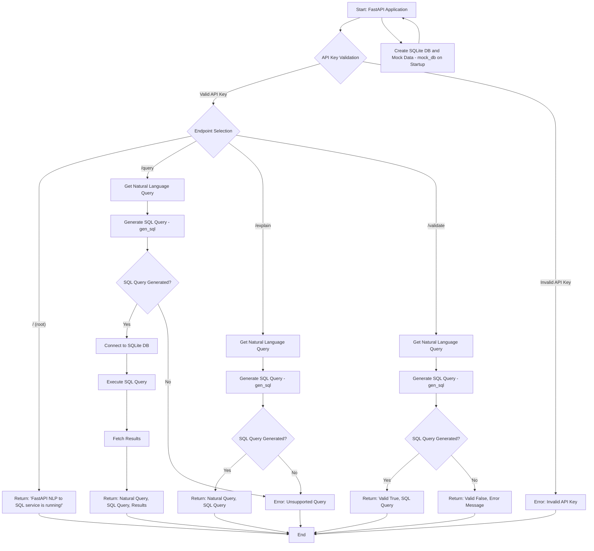

# FastAPI NLP to SQL Service

## Overview

This mock-project provides a lightweight REST API that simulates an AI-powered natural language to SQL query translation system. It allows users to send natural language queries and receive SQL translations along with simulated database results. The API includes basic authentication, error handling, and mock database storage.

## API Flowchart (Mermaid.js)



## Features

- Convert simple natural language queries to SQL.
- Return mock data based on query execution.
- Validate query feasibility.
- Explain how a natural query is translated.
- Basic API key-based authentication.

## Tech Stack

- **Language:** Python
- **Framework:** FastAPI
- **Database:** SQLite (in-memory storage for simplicity)
- **Hosting:** Render

## Setup Instructions

### Prerequisites

Ensure you have the following installed:

- Python 3.9+
- pip (Python package manager)
- curl (for testing API requests)

### Installation

1. Clone the repository:
   ```bash
   git clone https://github.com/SHIVATANDAV64/FastAPI_nlp_to_sql.git
   cd FastAPI_nlp_to_sql
   ```
2. Create a virtual environment and activate it:
   ```bash
   python -m venv venv
   source venv/bin/activate  # On Windows use: venv\Scripts\activate
   ```
3. Install dependencies:
   ```bash
   pip install -r requirements.txt
   ```
4. Run the server:
   ```bash
   uvicorn backend:app --reload
   ```
5. The API will now be accessible at `http://127.0.0.1:8000/`

## API Documentation

### Authentication

All endpoints require an API key to be passed via the `x-api-key` header.

**Example Header:**

```
-H 'x-api-key: secret-api'
```

### Endpoints

#### 1. Health Check

**GET /**

**Response:**

```json
{
  "message": "FastAPI NLP to SQL service is running!"
}
```

#### 2. Query Execution

**GET /query**

**Parameters:**

- `natural_query` (string) - The natural language query

**Example Request:**

```bash
curl -X GET "https://sql-translator-api.onrender.com/query?natural_query=count all shoes orders" \
-H "x-api-key: secret-api"
```

**Example Response:**

```json
{
  "query": "count all shoes orders",
  "sql": "Select Count(*) From sales_table Where Category = 'Shoes';",
  "results": [
    [
      3
    ]
  ]
}
```

#### 3. Query Explanation

**GET /explain**

**Example Request:**

```bash
curl -X GET "https://sql-translator-api.onrender.com/explain?natural_query=count all orders" \
-H "x-api-key: secret-api"
```

**Example Response:**

```json
{
  "query": "count all orders",
  "sql": "SELECT COUNT(*) FROM sales_table;"
}
```

#### 4. Query Validation

**GET /validate**

**Example Request:**

```bash
curl -X GET "https://sql-translator-api.onrender.com/validate?natural_query=show all hats orders" \
-H "x-api-key: secret-api"
```

**Example Response:**

```json
{
  "valid": true,
  "sql_translation": "SELECT * FROM sales_table WHERE Category = 'Hats';"
}
```

#### 5. Invalid Query Example

**Example Request:**

```bash
curl -X GET "https://sql-translator-api.onrender.com/query?natural_query=show all cars orders" \
-H "x-api-key: secret-api"
```

**Example Response:**

```json
{
  "detail": "Unsupported query"
}
```

## Supported Queries

| Natural Language Query    | SQL Equivalent                                                 |
| ------------------------- | -------------------------------------------------------------- |
| show all orders           | `SELECT * FROM sales_table;`                                   |
| count all orders          | `SELECT COUNT(*) FROM sales_table;`                            |
| show all t-shirts orders  | `SELECT * FROM sales_table WHERE Category = 'T-Shirts';`       |
| show all shoes orders     | `SELECT * FROM sales_table WHERE Category = 'Shoes';`          |
| show all hats orders      | `SELECT * FROM sales_table WHERE Category = 'Hats';`           |
| count all t-shirts orders | `SELECT COUNT(*) FROM sales_table WHERE Category = 'T-Shirts';`|
| count all shoes orders    | `SELECT COUNT(*) FROM sales_table WHERE Category = 'Shoes';`   |
| count all hats orders     | `SELECT COUNT(*) FROM sales_table WHERE Category = 'Hats';`    |
| show all Pending orders   | `SELECT * FROM sales_table WHERE status = 'Pending';`          |
| show all Cancelled orders | `SELECT * FROM sales_table WHERE status = 'Cancelled';`        |
| show all Shipped orders   | `SELECT * FROM sales_table WHERE status = 'Shipped';`          |
| show all Delivered orders | `SELECT * FROM sales_table WHERE status = 'Delivered';`        |
| count all Pending orders  | `SELECT COUNT(*) FROM sales_table WHERE status = 'Pending';`   |
| count all Cancelled orders| `SELECT COUNT(*) FROM sales_table WHERE status = 'Cancelled';` |
| count all Shipped orders  | `SELECT COUNT(*) FROM sales_table WHERE status = 'Shipped';`   |
| count all Delivered orders| `SELECT COUNT(*) FROM sales_table WHERE status = 'Delivered';` |


## Curl Links

**Valid links**
```bash
curl -X GET "https://sql-translator-api.onrender.com/query?natural_query=show all orders" -H "x-api-key: secret-api"
curl -X GET "https://sql-translator-api.onrender.com/explain?natural_query=count all orders" -H "x-api-key: secret-api"
curl -X GET "https://sql-translator-api.onrender.com/validate?natural_query=show all hats orders" -H "x-api-key: secret-api"
curl -X GET "https://sql-translator-api.onrender.com/validate?natural_query=count all delivered orders" -H "x-api-key: secret-api"
```

**Invalid links**
```bash
curl -X GET "https://sql-translator-api.onrender.com/query?natural_query=show all cars orders" -H "x-api-key: secret-api"
curl -X GET "https://sql-translator-api.onrender.com/query?natural_query=show all sales orders" -H "x-api-key: secret-api"
curl -X GET "https://sql-translator-api.onrender.com/query?natural_query=count all cars orders" -H "x-api-key: secret-api"
curl -X GET "https://sql-translator-api.onrender.com/query?natural_query=show all shoes orders" -H "x-api-key: no-api"
```
